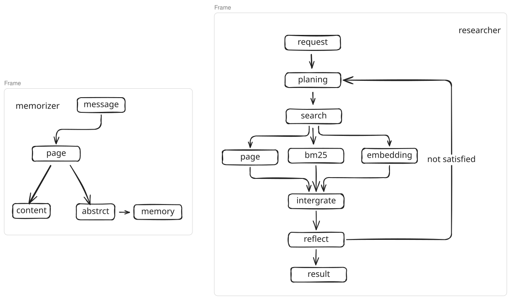

创新点：
1. 动态记忆：通过plan - search - reflect模式生成结果。

问题：
1. 最终效果和模型能力关系很大。
2. 前后记忆有矛盾的情况下，如何处理？
3. 记忆长度有限，需要输入所有的记忆摘要。
4. 开源架构局限性很大。

## workflow

整体架构如图所示，包含memorizer、researcher两部分：

1. memorizer
	1. 每个message是一个page，page内保存有llm提取的摘要abstract、原始message。
		1. abstract是llm根据message、历史记忆（history abstract）生成，生成原则：
			1. 简洁。目的是扩大context的范围，所以需要简短。
			2. 完备。message的信息不能有损失。
			3. 增量。不能重复历史已有信息。
	2. 索引：每个page，建立三种索引：
		1. 原文
		2. bm25
		3. embedding
2. researcher
	1. plan
		1. 根据request生成：索引类型、索引内容
	2. integrate
		1. 整合检索结果
	3. reflect
		1. 判断结果是否满足request：
			1. 不满足，生成新的request继续。
			2. 满足，生成答案。

## 参考
1. https://arxiv.org/abs/2511.18423
2. https://github.com/VectorSpaceLab/general-agentic-memory
