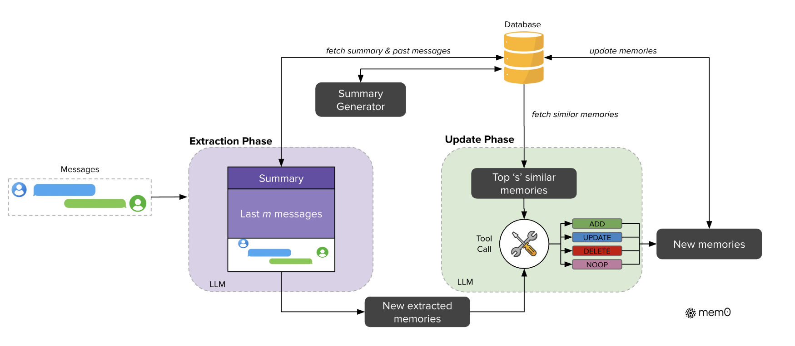
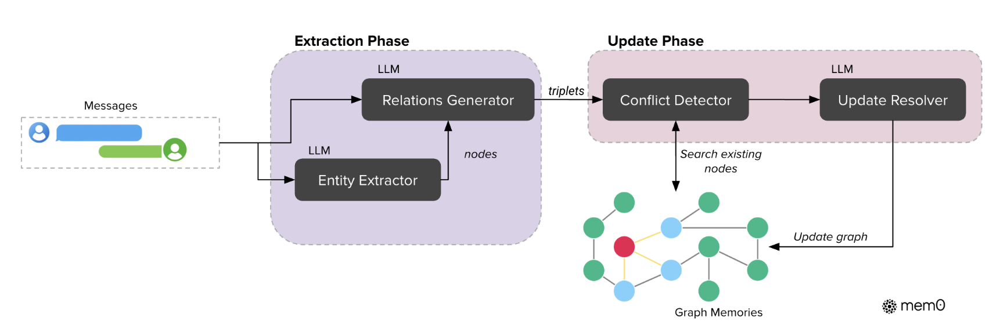

URL: https://github.com/mem0ai/mem0

mem0是memai的开源记忆工具，包含两种记忆存储方式：
1. 基于embedding的记忆存储。
2. 基于graph的记忆存储。

### 基于embedding
组成元件：
1. 事实。由message经过llm提取的fact。
2. 事实数据库。存储、查询llm提取的事实的embedding。
3. Summary。全局事实的总结。
4. 事实提取。
5. 事实数据库更新。

事实提取：
- 使用全局总结Summary、和最近的几个fact，提取当前message的fact。

事实数据库更新：
- 使用上一步提取的fact，从数据库中检索最相近的几条实时。
- 用llm判断需要对数据库进行的操作：
	- add：新增事实。
	- update：更新已有事实。
	- delete：删除已有事实。
	- noop：不做任何操作。

### 基于graph

和基于embedding的方式类型，把事实数据库，由embedding存储，更换为graph存储。
存储结构：
- node：具体的entity。
	- label：node的类型，人、城市、时间等。
	- embedding：node的embedding。
- edge：关系。

检索：
- 从query中提取entity：利用entity的embedding查找node，进而提取subgraph的信息。
- query整体embedding，查找相近的关系三元组（relationship triplet）。

